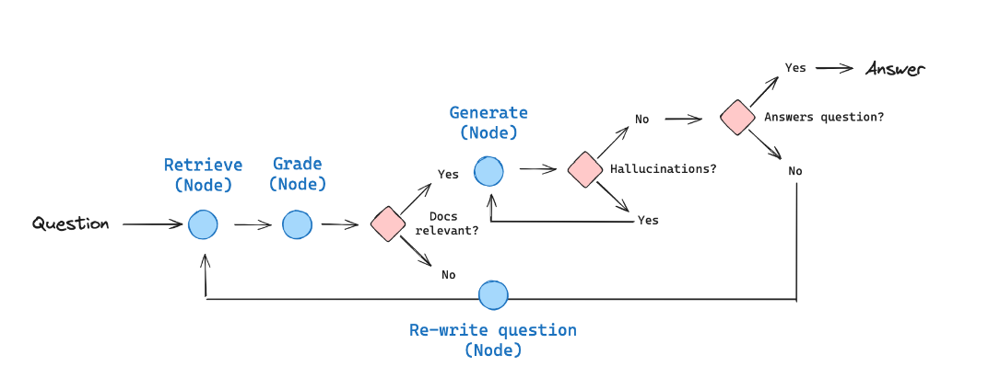

# POC com Langgraph

A poc consiste em utilizar o Langgraph para criar um Self-Reflective Retrieval-Augmented Generation (Self-RAG). 




## Tecnologias utilizadas nas POCs
- [Docker](https://www.docker.com/)
- [DevContainer](https://code.visualstudio.com/docs/devcontainers/containers)
- [Ollama](https://ollama.com/)
- [Langchain](https://www.langchain.com/)
- [Langgraph](https://langchain-ai.github.io/langgraph/)
- [Llama3](https://llama.meta.com/llama3/)


## Execução

### Requisitos
- Docker
- Docker Compose
- VSCode
- Extensões do VSCode:
    - DevContainer => `ms-vscode-remote.remote-containers`
    - Docker => `ms-azuretools.vscode-docker`

### Execução
 - Abrir o projeto no VSCode e selecionar a opção `Open a Remote Window`
 - Em um terminal na máquina física executar o comando para baixar o modelo [LLAMA3](https://llama.meta.com/llama3/) para o ollama. Ao terminar, pode executar o notebook.
 ```
 docker exec -it langgraph-ollama ollama pull llama3
 ```